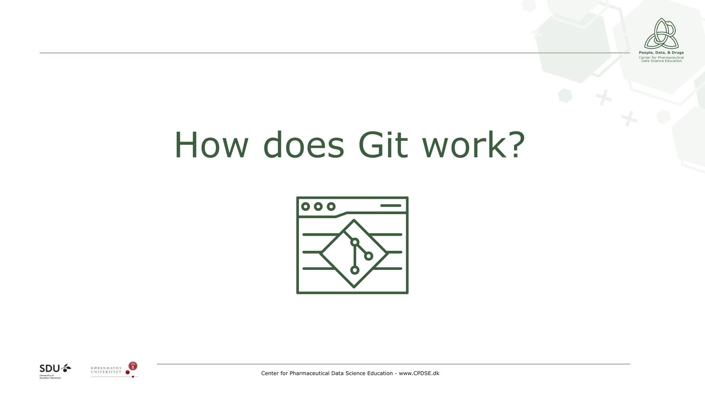
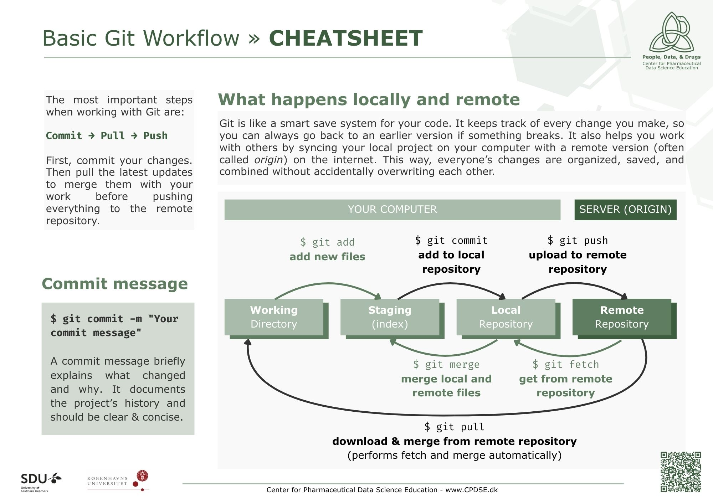
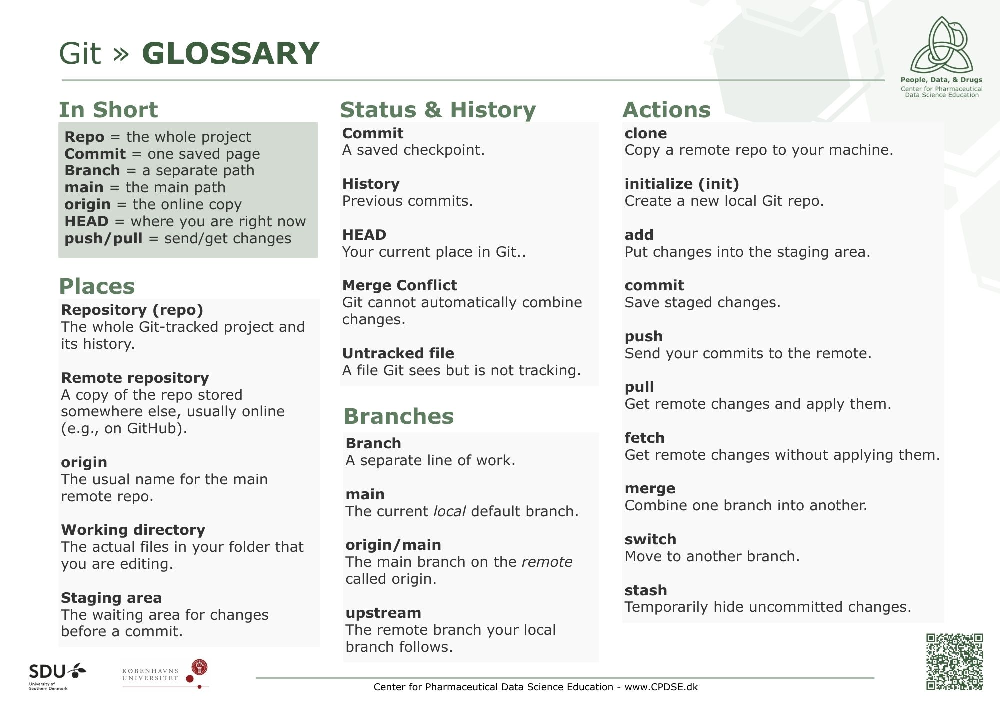
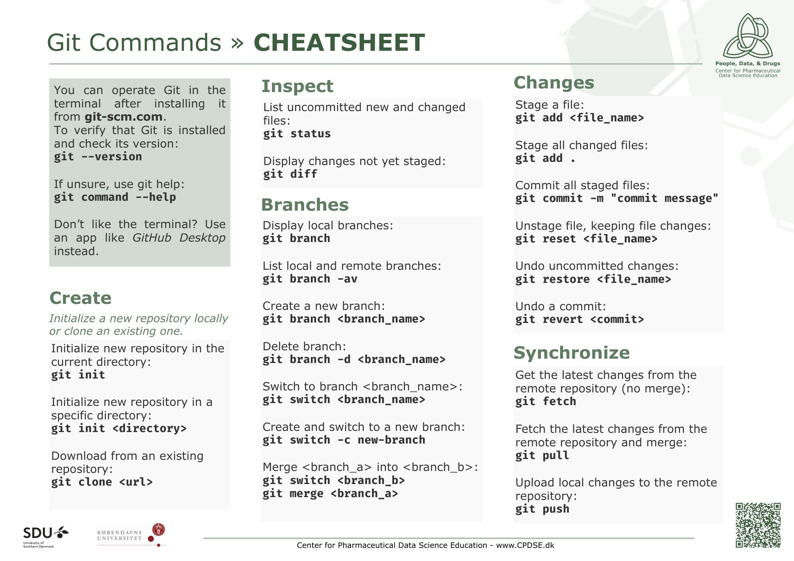
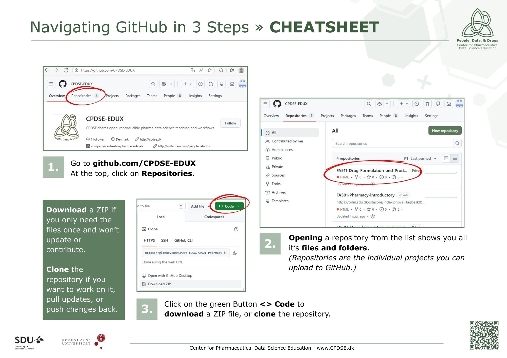
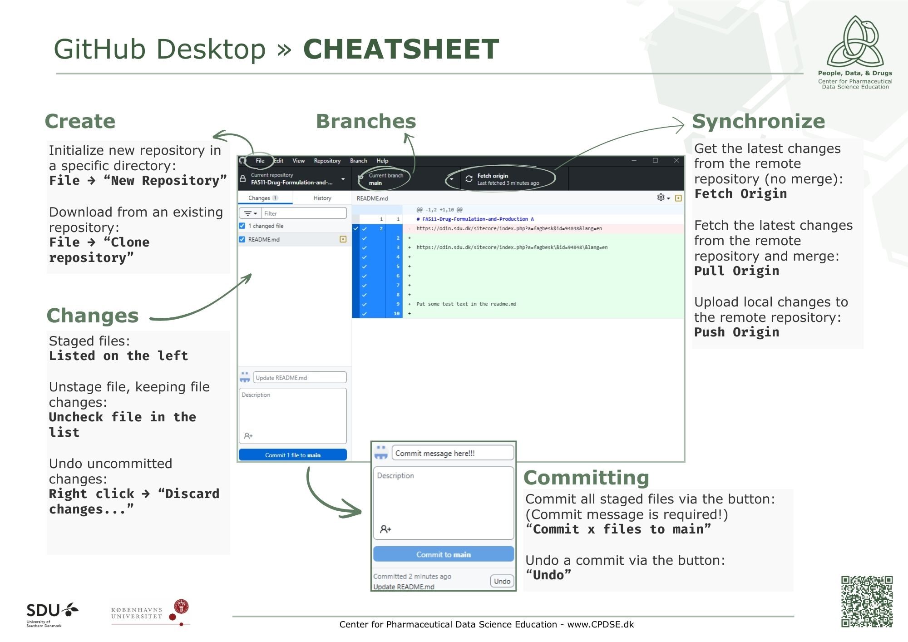

# CPDSE Cheat Sheets

A collection of CPDSE cheat sheets for educational purposes.

## Git

<table>
  <tr>
    <td align="center">
      <a href="./Git/How%20does%20Git%20work.pdf">
         
        <b>How does Git work</b>
      </a>
    </td>
    <td align="center">
      <a href="./Git/Basic%20Git%20Workflow.pdf">
         
        <b>Basic Git Workflow</b>
      </a>
    </td>
    <td align="center">
      <a href="./Git/Git%20Glossary.pdf">
         
        <b>Git Glossary</b>
      </a>
    </td>
    <td align="center">
      <a href="./Git/Git%20Commands.pdf">
         
        <b>Git Commands</b>
      </a>
    </td>
  </tr>
</table>

## GitHub

<table>
  <tr>
    <td align="center">
      <a href="./Git/Navigating%20GitHub%20in%203%20Steps.pdf">
         
        <b>Navigating GitHub in 3 Steps</b>
      </a>
    </td>
    <td align="center">
      <a href="./Git/GitHub%20Desktop.pdf">
         
        <b>GitHub Desktop</b>
      </a>
    </td>
  </tr>
</table>
